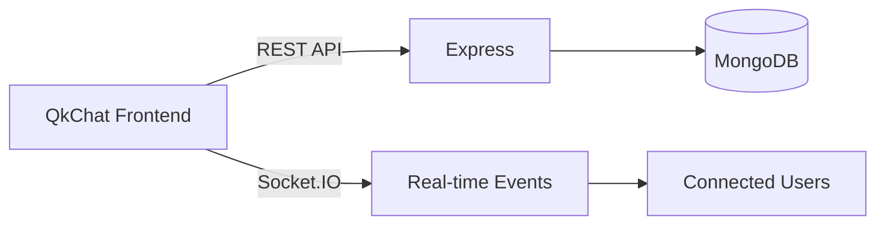
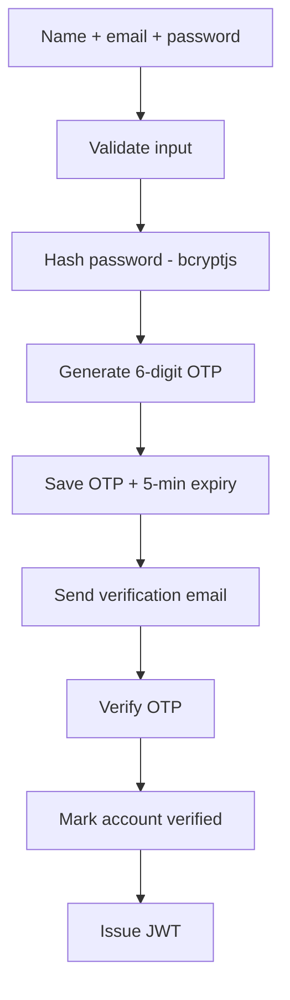
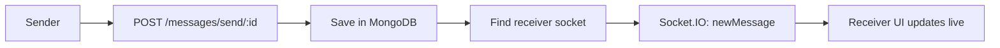

<div align="center">

# 💬 QkChat

**A full-stack real-time chat application built on the MERN stack** — with OTP-secured auth, live messaging, image sharing, presence & typing indicators, and **Astra**, a built-in AI assistant powered by Google Gemini.


[](./LICENSE)

[Features](#-features) • [Screenshots](#-screenshots) • [Tech Stack](#️-tech-stack) • [Architecture](#-architecture) • [Getting Started](#️-getting-started) • [Roadmap](#-roadmap)
</div>

---

## ✨ Features

**Authentication**
- JWT auth with protected routes, bcryptjs password hashing
- Email verification via 6-digit OTP (5-min expiry, resend support)
- Forgot-password / reset-password OTP flow
**Real-time messaging**

- One-to-one chat over Socket.IO with persistent message history in MongoDB
- Real-time online/offline presence
- Live typing indicators
- Message delivery and seen status
- Automatic scrolling to the latest message
- Sticky chat date indicators with Today, Yesterday, and formatted dates
- Date header visibility changes based on scroll direction
- Image sharing via Cloudinary

**Astra — AI assistant**
- In-app conversations powered by Google Gemini
- Markdown rendering, syntax-highlighted code blocks, clickable links
- Recent chat history sent as context; animated thinking/response states

**UI/UX**

- Responsive desktop/tablet/mobile layout
- Mobile-first chat behavior
- Multiple DaisyUI themes
- Toast notifications
- Automatic chat scrolling
- Sticky date headers while navigating chat history
- Scroll-aware date header visibility
- Zustand-driven global state management

---

## 🛠️ Tech Stack
| Layer | Technologies |
| --- | --- |
| **Frontend** | React, Vite, Tailwind CSS, DaisyUI, Zustand, Axios, React Router, React Markdown, React Syntax Highlighter, Lucide React, Framer Motion, React Hot Toast |
| **Backend** | Node.js, Express.js, Socket.IO, JWT, bcryptjs, Nodemailer |
| **Database & Storage** | MongoDB, Mongoose, Cloudinary |
| **AI** | Google Gemini API, Google GenAI SDK |
| **Email** | Gmail SMTP via Nodemailer, HTML email templates |
---

## 🌐 Architecture

QkChat splits work between REST (persistent request/response) and Socket.IO (instant events):



- **REST** — auth, OTP flows, user list, conversation history, sending messages, profile updates, AI requests
- **Socket.IO** — new messages, online users, typing / stop-typing status

<details>
<summary><strong>Auth flow (signup → verified account)</strong></summary>



</details>

<details>
<summary><strong>Message delivery flow</strong></summary>



</details>

### Data models

**User** — name, email, hashed password, profile picture, verification status, OTP / OTP expiry, reset-OTP / expiry
**Message** — `senderId`, `receiverId`, `text`, `image`, `createdAt`, `updatedAt` (references `User` via Mongoose)

### Cloud services

| Service | Purpose |
|---|---|
| MongoDB | Users & persistent messages |
| Cloudinary | Profile pictures & chat images |
| Google Gemini | Astra's AI responses |
| Gmail (Nodemailer) | Transactional OTP / reset emails |

---

## 📁 Project Structure

```text
QkChat/
├── frontend/
│   └── src/
│       ├── components/
│       ├── pages/
│       ├── store/
│       ├── lib/
│       └── assets/
├── backend/
│   ├── controllers/
│   ├── models/
│   ├── routes/
│   ├── lib/
│   └── server/
├── .gitignore
└── README.md
```

---

## ▶️ Getting Started

### Prerequisites
- Node.js and npm
- A MongoDB connection string
- Cloudinary, Gmail (App Password), and Gemini API credentials

### Environment variables

Create a `.env` file (never commit it — see `.gitignore`):

```env
MONGODB_URI=your_mongodb_connection_string
JWT_SECRET=your_jwt_secret
CLIENT_URL=http://localhost:5173

EMAIL_USER=your-qkchat-email@gmail.com
EMAIL_PASS=your-google-app-password

CLOUDINARY_CLOUD_NAME=your_cloudinary_name
CLOUDINARY_API_KEY=your_cloudinary_key
CLOUDINARY_API_SECRET=your_cloudinary_secret

GEMINI_API_KEY=your_gemini_api_key
```

### Installation

```bash
# Backend
cd backend
npm install
npm run dev

# Frontend (in a separate terminal)
cd frontend
npm install
npm run dev
```

---

## 🔒 Security Practices

- bcryptjs password hashing, JWT auth on protected routes
- Secrets kept in environment variables; Gmail App Password (not a real password)
- OTP expiration + invalidation after use; verified-account requirement for password reset
- Cloudinary secure URLs

> Production hardening (rate limiting, OTP attempt limits, stricter CORS/upload validation) is planned for V2 — see [Roadmap](#-roadmap).

---

## 🧭 Roadmap

**✅ V1 — Completed:** Auth (JWT, OTP, reset flow), real-time 1:1 chat with presence & typing, image sharing, Astra AI assistant, responsive UI, transactional email.

**🚀 V2 — Final phase (planned):**
- 📹 **Video calling** — WebRTC peer-to-peer media with Socket.IO signaling
- 📄 **Astra PDF upload + RAG** — extract → chunk → embed → retrieve → answer from user documents (Node.js pipeline; MongoDB Atlas Vector Search or Qdrant/Pinecone/Chroma)
- 👥 **Group chat** — Socket.IO rooms, admins, group presence & typing
- 💬 **Message states** — sent / delivered / seen, timestamps, unread handling
- 🛡️ **Production hardening** — rate limiting, structured logging, tests, HTTPS/CORS, monitoring

<details>
<summary>Full V1 testing checklist</summary>

**Authentication:** signup validation, OTP send/verify/expire/resend, login/logout, forgot & reset password
**Messaging:** load users, send/receive live messages, persistence on refresh,
online/offline & typing states, message delivery/seen status, image
send/receive, automatic scroll-to-bottom, sticky date headers,
scroll-direction behavior, mobile & desktop layouts
**Astra:** open/close, send/receive prompts, markdown & code rendering, syntax highlighting, link handling, no duplicate panel instances

</details>

---

## 🎯 Project Goal

QkChat exists to demonstrate practical full-stack engineering across the board — frontend architecture, REST APIs, real-time WebSockets, auth, database modeling, cloud media storage, AI integration, transactional email, and responsive UI/state management — rather than being a single-purpose CRUD app.

---

## 👨‍💻 Author

**Krish Dayal**
Full-stack MERN engineering project.